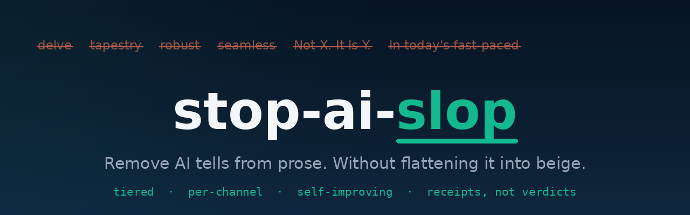

<p align="center">
  
</p>

<h1 align="center">stop-ai-slop</h1>

<p align="center"><em>Remove AI tells from prose without flattening it into beige.</em></p>

<p align="center">
  <a href="https://github.com/Lekha-Reddy-git-hub/stop-ai-slop/stargazers"></a>
  <a href="LICENSE"></a>
  
  
</p>

<p align="center"><sub><a href="#why-its-different">Why</a> · <a href="#what-it-catches">What it catches</a> · <a href="#how-it-works">How it works</a> · <a href="#install">Install</a> · <a href="#examples">Examples</a> · <a href="#pairs-with-voiceprint">Voiceprint</a> · <a href="#faq">FAQ</a> · <a href="#license">License</a></sub></p>

AI writing has patterns: predictable phrases, structures, rhythms, and formatting.
This skill removes them. What makes it different from a plain banlist is that it
will not trade one slop for another. Strip AI text with a naive remover and you get
clipped, punchy, LinkedIn-broetry copy, which is its own tell. stop-ai-slop is
tiered, context-aware, channel-aware, and it measures instead of guessing.

Not a detector-bypass tool. The goal is writing that is actually better, not writing
that sneaks past an AI checker.

## Why it's different

- **Tiered, not blanket.** always-cut / cut-unless-context / frequency-capped, so it
  stops over-correcting harmless phrases.
- **Per-channel.** Separate logic for X, LinkedIn, cold email, warm email, articles.
  No one else segments by where you post.
- **It measures.** `slop_score.py` gives countable metrics, not a self-rated rubric.
- **It stays current.** `slop_miner.py` auto-discovers new tells as models change.
- **It knows what NOT to flag.** `false-positives.md` protects real human writing so
  the tool never sands every writer into the same paste.

## What it catches

| Layer | File | Examples |
| --- | --- | --- |
| Phrases | `phrases.md` | vocabulary tells, dead phrases, business jargon, fake specificity |
| Structures | `structures.md` | the "Not X. It is Y." pivot, rule-of-three, dramatic fragments |
| Formatting | `formatting.md` | bold-lead bullet walls, header-per-paragraph, emoji bullets, em-dashes |
| Sycophancy | `sycophancy.md` | "Great question!", hedging stacks, "In conclusion", audience-hailing |
| Channels | `channels.md` | per-platform slop for X, LinkedIn, cold/warm email, long-form |
| Full catalog | `catalog.md` | false agency, narrator-from-a-distance, passive voice, copula avoidance, Wh- openers |
| Guardrail | `false-positives.md` | what NOT to flag, and the signs of real human writing to keep |

## How it works

**Detect, rewrite, check.**

1. **Detect.** Run `slop_score.py` for objective counts: banned phrases, em-dash
   density, bullet-to-prose ratio, sentence-length variance, contrast-pivot count.
2. **Rewrite.** Fix only what fires. Apply the channel layer. Preserve meaning,
   facts, quotes, and voice.
3. **Check.** Re-run the score. Confirm it improved AND that you did not over-correct
   into short-punchy slop.

## Install

**Easiest, no setup. Works in Claude or ChatGPT.**
Open [`SKILL.md`](SKILL.md), copy all of it, paste it into a new chat, then paste
your draft and say "apply this skill, keep my meaning and my voice." That is it.

**Claude Code (auto-loads whenever it is relevant).** One line, copy and paste:

```bash
git clone https://github.com/Lekha-Reddy-git-hub/stop-ai-slop ~/.claude/skills/stop-ai-slop
```

**Claude Projects or a Custom GPT (always on).**
Upload `SKILL.md` plus the reference files to the project knowledge, or into the
GPT's instructions.

**Cursor or Codex.** Paste `SKILL.md` into your rules file or system prompt.

## Examples

Each example shows *before, wrong fix, right fix*, so the model learns the
difference between de-slopping and over-correcting into a second slop. See
[`examples.md`](examples.md). One taste:

> **Before:** In today's fast-paced landscape, we need to lean into discomfort and
> navigate uncertainty with clarity.
>
> **Wrong fix:** Move faster. Your competition is. *(a punchy quotable, its own slop)*
>
> **Right fix:** Your competitors are moving quickly, so being comfortable with
> uncertainty is now part of the job.

## Pairs with voiceprint

stop-ai-slop subtracts the machine.
[voiceprint](https://github.com/Lekha-Reddy-git-hub/voiceprint) adds the human: it
learns your voice from your own writing and renders your raw thoughts in it. Use
stop-ai-slop alone to clean text, or together to rewrite in your voice and de-slop
in one pass. Sound like YOU, not sound generically human, is the part no humanizer
does.

## FAQ

**Is this an AI detector or a way to beat one?** Neither. It is a writing-improvement
tool. Detectors are unreliable and biased against non-native English writers
([Liang et al., Patterns 2023](https://arxiv.org/abs/2304.02819)), so "beat the
detector" is not a goal here.

**Does it just delete everything that looks like AI?** No. That is the failure it is
built to avoid. It looks for clusters of tells, not isolated ones, and protects the
signs of real human writing. See `false-positives.md`.

**Will it strip my own voice?** Not if you pair it with voiceprint, which marks your
signature moves as protected. On its own it is baseline-neutral.

**Does it work outside Claude?** Yes. The rules target writing, not one tool. Claude,
Cursor, Codex, and plain system prompts all work.

## Credits

Based on [stop-slop](https://github.com/hardikpandya/stop-slop) by Hardik Pandya (MIT),
and folds in patterns from Wikipedia's "Signs of AI writing" (WikiProject AI Cleanup)
via the [humanizer](https://github.com/blader/humanizer) skill (MIT).

## License

MIT. See [LICENSE](LICENSE).
